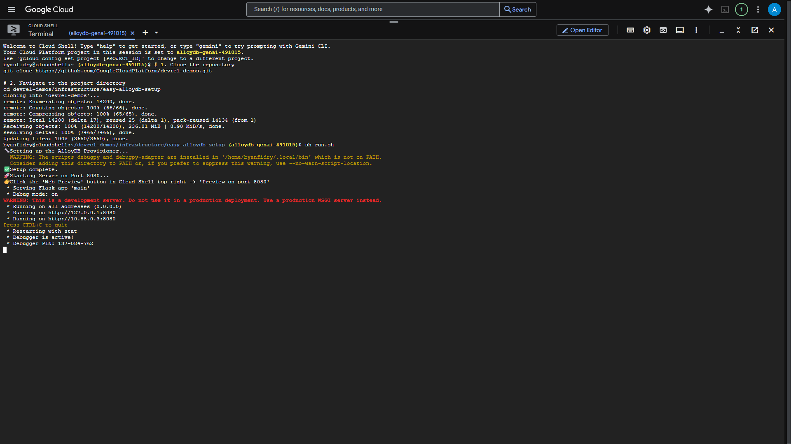
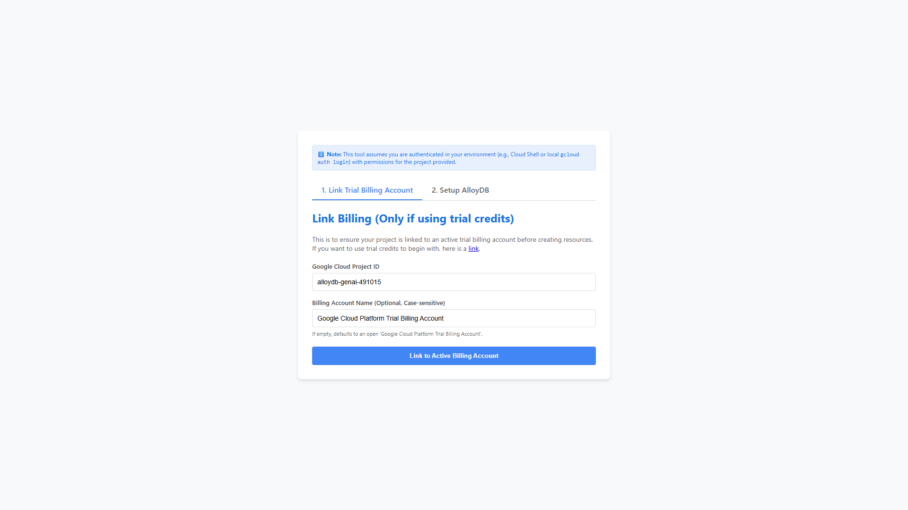
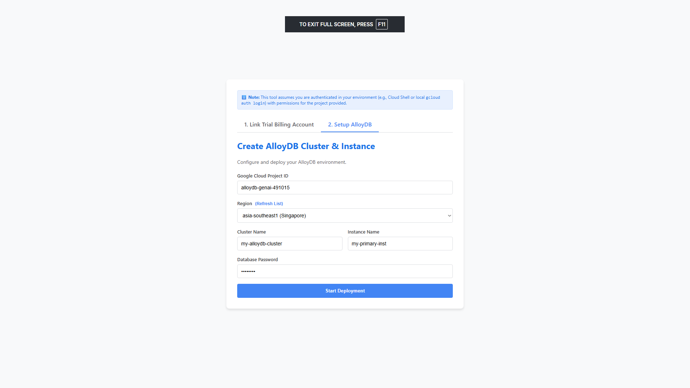
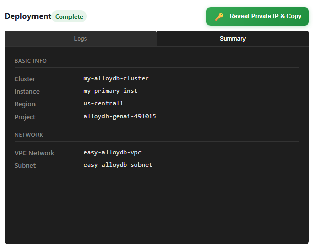
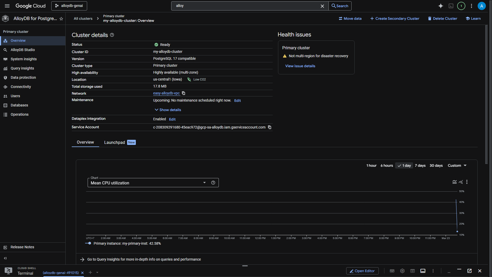
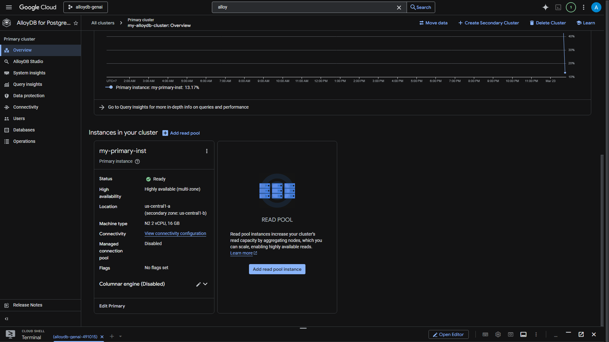
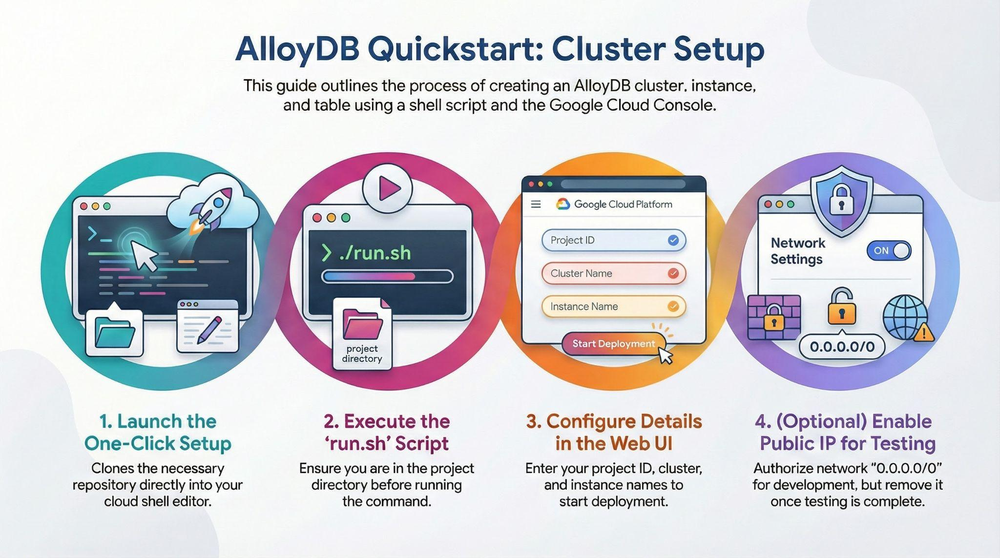

# AlloyDB Quick Setup Lab | Google Codelabs

Codelabs: [AlloyDB Quick Setup Lab](https://codelabs.developers.google.com/quick-alloydb-setup?hl=en#0)

## Overview

With this codelab, we will demonstrate a simple, easy-to-do method for setting up AlloyDB.

### What you'll build

As part of this, you will create an AlloyDB instance and cluster in one click installation and you'll learn to set it up quickly in your future project as well.

### Requirements

- A browser
- A Google Cloud project with **billing enabled**.

## Before you begin

**Create a project**:

1. In the [Google Cloud Console](https://console.cloud.google.com/?utm_campaign=CDR_0x1d2a42f5_default_b419133749&utm_medium=external&utm_source=blog), on the project selector page, select or create a Google Cloud [project](https://docs.cloud.google.com/resource-manager/docs/creating-managing-projects?utm_campaign=CDR_0x1d2a42f5_default_b419133749&utm_medium=external&utm_source=blog).
2. Make sure that billing is enabled for your Google Cloud project. Learn how to [check if billing is enabled on a project](https://cloud.google.com/billing/docs/how-to/verify-billing-enabled?utm_campaign=CDR_0x1d2a42f5_default_b419133749&utm_medium=external&utm_source=blog).
3. You'll use [Cloud Shell](https://cloud.google.com/cloud-shell/?utm_campaign=CDR_0x1d2a42f5_default_b419133749&utm_medium=external&utm_source=blog), a command-line environment running in Google Cloud. Click **Activate Cloud Shell** at the top of your console.
4. Once connected to Cloud Shell, you check that you're already authenticated and that the project is set to your project ID using the following command:

    ```bash
      gcloud auth list
    ```

5. Run the following command in Cloud Shell to confirm that the gcloud command knows about your project.

    ```bash
      gcloud config list project
    ```

6. If your project is not set, use the following command to set it:

    ```bash
      gcloud config set project <YOUR_PROJECT_ID>
    ```

7. Enable the required APIs:
   - AlloyDB API
   - Compute Engine API
   - Cloud Resource Manager API
   - Service Networking API
   - Cloud Run Admin API
   - Cloud Build API
   - Cloud Functions API
   - Vertex AI API

## Why AlloyDB for your business data & AI?

AlloyDB for PostgreSQL isn't just another managed Postgres service. It is a fundamental modernization of the engine designed for the AI era. Here is why it stands alone compared to standard databases:

1. **Hybrid Transactional & Analytical Processing (HTAP)**
    Most databases force you to move data to a data warehouse for analytics. AlloyDB has a built-in **Columnar Engine** that automatically keeps relevant data in a column store in-memory. This makes analytical queries up to **100x faster** than standard PostgreSQL, allowing you to run a real-time business intelligence on your operational data without complex ETL pipelines.
2. **Native AI Integration**
    AlloyDB bridges the gap between our data and Generative AI. With the `google_ml_integration` extension, you can call Vertex AI models (like Gemini) directly within your SQL queries. This means you can perform sentiment analysis, translation, or entity extraction as a standard database transaction, ensuring data security and minimizing latency.
3. **Superior Vector Search**
    While standard PostgreSQL uses `pg_vector`, AlloyDB supercharges it with the **ScaNN index** (Scalable Nearest Neighbors), developed by Google Research. This provides significantly faster vector similarity search and higher recall at RAG (Retrieval Augmented Generation) application natively.
4. **Performance at Scale**
    AlloyDB offers up to **4x faster** transactional performance than standard PostgreSQL. It separates compute from storage, allowing them to scale independently. The storage layer is intelligent, handling write-ahead logging (WAL) processing to offload work from the primary instance.
5. **Enterprise Availibility**
    It offers a **99.99% uptime SLA**, inclusive of maintenance. This level of reliability for a PostgreSQL-compatible database is achieved through a cloud-native architecture that ensures rapid failure recovery and storage durability.

## AlloyDB Setup

In this lab we'll use [AlloyDB](https://cloud.google.com/alloydb/docs/overview#clusters?utm_campaign=CDR_0x1d2a42f5_default_b419133749&utm_medium=external&utm_source=blog) as the database for the test data. It uses clusters to hold all of the resources, such as databases and logs. Each cluster has a primary instance that provides an access point to the data. Tables will hold the actual data.

Let's create an AlloyDB cluster, instance and table where the test dataset will be loaded.

```bash
  # Clone Repository
  git clone https://github.com/GoogleCloudPlatform/devrel-demos.git

  # Navigate to directory
  cd devrel-demos/infrastructure/easy-alloydb-setup

  # Run shell
  sh run.sh
```



Now use the UI (clicking the link in the terminal or clicking the "preview on web" link in the terminal).

Enter your details for project id, cluster and instance names to get started.



Setup AlloyDB






Go grab a coffee while the logs scroll & you can read about how it's doing this behind the scenes here.

> If you want to test it locally or from anywhere, go to the AlloyDB instance, click "EDIT" and click "Enable Public IP" or "Public IP Connectivity" (not the outbound one) and enter "0.0.0.0/0" in "Authorized External Networks" for development purposes but once done, remove & disable public ip connectivity.



## Cleanup

Once this trial lab is done, do not forget to delete alloyDB cluster and instance.

> Go to https://console.cloud.google.com/alloydb/clusters. Select the cluster you want to delete by clicking on the vertical ellipsis next to it and click DELETE.

It should clean up the cluster along with its instance(s).