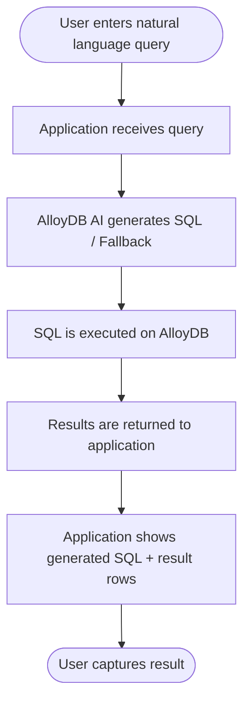

# Track 3 Project Submission (AlloyDB AI Natural Language)

## Participant Information

- Name: Abyan Fidriyansyah
- Track: Track 3 - Build AI-powered applications using AI-ready databases like AlloyDB
- Repository Scope: This README is specific to Track 3 only

## Project Submission (Program Dashboard Requirements)

### Problem Statement

Build a small AI-enabled database feature using AlloyDB for PostgreSQL that enables users to query a custom dataset using natural language and receive meaningful results.

The goal of this mini project is to demonstrate how AI-ready databases can be applied to a specific data use case, beyond a guided lab environment.

### What You Must Build

You must build one database-centric capability using AlloyDB that satisfies all of the following:

Build a simple software setup where:

1. A dataset of your choice (different from the lab's default dataset) is stored in AlloyDB.
2. At least one table schema is modified or created by you.
3. AlloyDB AI natural language is enabled for this dataset.
4. A natural language query related to your dataset's context is provided.
5. The system:
   - Converts the natural language input into a SQL query.
   - Executes the query against AlloyDB.
   - Returns relevant results from your dataset.

### Explicit Constraint (Prevents Lab Reuse)

You may use the lab as a reference, but:

1. The dataset must not be the default lab dataset.
2. At least one query must be your own, not copied from the lab.
3. The use case must be described in one sentence (for example: Querying sales data, Exploring support tickets).

## Problem Statement (Track 3 Product Implementation)

Build a production-style IT support intelligence feature that allows users to ask plain-English operational questions and get SQL-backed answers from AlloyDB using a real support-ticket dataset.

## Brief About the Idea

This project implements a natural language support analytics assistant on AlloyDB. A real IT support ticket dataset is cleaned to English-only, loaded into a custom schema with generated urgency scoring, and queried through an application that shows both generated SQL and returned results.

The core objective is to reduce manual SQL dependency for support operations while preserving transparency and reproducibility.

## Meeting Build Criteria

### How this project navigates Track 3 requirements using AlloyDB AI

1. Custom Dataset in AlloyDB:
   - Uses a real IT support ticket dataset, not the default lab dataset.
   - The dataset is cleaned to English-only for stable NL query behavior.

2. Schema Modified/Created:
   - Custom `support_tickets` schema is created.
   - Generated columns include `urgency_score` and `urgency_bucket`.
   - Additional operational fields are modeled for practical support analysis.

3. AlloyDB AI Natural Language Enabled:
   - AlloyDB AI NL setup is included in SQL configuration flow.
   - NL-to-SQL function template is configurable by environment.

4. Original Natural Language Queries:
   - Example custom queries:
     - Show high-urgency incident tickets in Technical Support for the last 30 days.
     - Top outage-related tags in English tickets.
     - Which queues have the most urgent open tickets?

5. End-to-End Pipeline Demonstrated:
   - NL input -> SQL generation -> SQL execution in AlloyDB -> result display in Cloud Run app.

## Opportunities

### How different is this from existing ideas?

- Many dashboards depend on fixed filters and pre-authored SQL.
- This solution enables free-form natural language analysis over support operations.
- It combines generated SQL transparency with domain scoring in the database layer.

### How does it solve the problem?

- Reduces time to investigate urgent support incidents.
- Makes support insights accessible to users who do not write SQL.
- Preserves auditability by displaying SQL used for each answer.

### USP of the proposed solution

A reproducible, low-cost, natural-language support intelligence workflow using real ticket data, AlloyDB AI, and Cloud Run deployment with one-command automation options.

## List of Features Offered by the Solution

1. Real dataset ingestion and cleaning (English-only filter).
2. Custom AlloyDB schema with generated urgency scoring.
3. Natural language to SQL query pipeline.
4. SQL transparency in UI (generated SQL is shown).
5. Query result rendering for operational decision support.
6. Cloud Run deployment with public URL.
7. Optional full automation for provision-build-deploy.
8. Optional full teardown for cost control and reproducibility.

## Process Flow Diagram / Use-Case Diagram



## Technologies Used in the Solution

### Database and AI

- AlloyDB for PostgreSQL
- AlloyDB AI Natural Language
- PostgreSQL generated columns

### Application and Runtime

- Python
- Flask
- psycopg
- gunicorn

### Cloud and Deployment

- Google Cloud Run
- Cloud Build
- (Optional automation) VPC Access Connector and AlloyDB provisioning scripts

### Data and Processing

- Real IT support ticket CSV dataset
- Python-based data cleaning and seeding scripts

## Snapshots of the Prototype (What to Showcase)

Add screenshots for the following proof points:

1. Cloud Run service URL page open in browser.
2. Natural language query input in the app.
3. Generated SQL section visible for the same query.
4. Query results section visible for the same query.
5. AlloyDB table view showing `support_tickets` data loaded.
6. Schema view showing generated columns (`urgency_score`, `urgency_bucket`).
7. Optional: terminal output of automation script showing successful deploy URL.

## Final Presentation Statement

This Track 3 submission demonstrates a complete AI-enabled database capability on AlloyDB using a real, non-lab dataset and natural language querying. The solution satisfies all required build criteria, provides a live Cloud Run endpoint, and emphasizes reproducibility through scripted setup, deployment, and teardown.

## Future Improvement Recommendations

1. Replace fallback rules with fully managed AlloyDB AI NL configuration tuned to this dataset.
2. Add row-level security and role-based access for multi-team production usage.
3. Add monitoring dashboards for query latency and NL-to-SQL accuracy.
4. Introduce semantic tagging and vector search for deeper ticket similarity insights.
5. Add CI/CD pipelines for automated testing and deployment validation.
6. Add cost guardrails with scheduled auto-shutdown windows.

---

## Step-by-Step: How It Works and How to Reproduce

This repository may contain Track 1, Track 2, and Track 3. For this submission, only use the Track 3 folder.

### 1. Clone repository and open Track 3 folder

```bash
git clone <your-github-repo-url>
cd <repo-root>
cd "Projects/Track 3 - Build AI-powered applications using AI-ready databases like AlloyDB"
```

### 2. Choose execution mode

#### Option 0: One-click provision + deploy (auto random DB password)

```bash
export PROJECT_ID="your-project-id"
export REGION="asia-southeast2"
export SERVICE_NAME="alloydb-nl"

# Optional: override defaults
# export SEED_LIMIT="5000"
# export APP_NL_TO_SQL_TEMPLATE="select alloydb_ai_nl.get_sql('track3_cfg','{question}') ->> 'sql'"

bash scripts/one_click_provision.sh
```

This mode auto-generates `DB_PASSWORD` if you do not provide one.

#### Option 0B: One-click deploy using existing AlloyDB (no new cluster)

```bash
export PROJECT_ID="your-project-id"
export REGION="us-central1"
export SERVICE_NAME="alloydb-nl"

export DB_HOST="your-existing-alloydb-private-ip"
export DB_PORT="5432"
export DB_NAME="postgres"
export DB_USER="postgres"
export DB_PASSWORD="your-db-password"

export AUTO_PROVISION="false"
export SEED_LIMIT="5000"
export APP_NL_TO_SQL_TEMPLATE="select alloydb_ai_nl.get_sql('track3_cfg','{question}') ->> 'sql'"

bash scripts/one_click_provision.sh
```

This mode skips AlloyDB provisioning and only runs setup, seed, and Cloud Run deploy.

#### Option A: Fully automated (provision + configure + seed + deploy)

```bash
export PROJECT_ID="your-project-id"
export REGION="us-central1"
export SERVICE_NAME="alloydb-nl"
export DB_PASSWORD="your-strong-password"

export AUTO_PROVISION="true"
export SEED_LIMIT="5000"

# Optional: leave empty for fallback mode if NL function is not configured yet
export APP_NL_TO_SQL_TEMPLATE=""

bash scripts/bootstrap_track3.sh
```

#### Option B: Existing AlloyDB (skip infrastructure provisioning)

```bash
export PROJECT_ID="your-project-id"
export REGION="us-central1"
export SERVICE_NAME="alloydb-nl"

export DB_HOST="your-alloydb-ip"
export DB_PORT="5432"
export DB_NAME="postgres"
export DB_USER="postgres"
export DB_PASSWORD="your-db-password"

export AUTO_PROVISION="false"
export SEED_LIMIT="5000"

# Optional: set real template if NL is configured; otherwise keep empty for fallback mode
export APP_NL_TO_SQL_TEMPLATE=""

bash scripts/bootstrap_track3.sh
```

### 2.1 Confirm AlloyDB AI NL function in your environment

To use true AlloyDB AI NL (instead of fallback SQL), confirm function compatibility first:

1. Update environment-specific SQL setup in `sql/03_nl_config.sql`.
2. Verify the NL function/signature available in your AlloyDB instance.
3. Set `APP_NL_TO_SQL_TEMPLATE` to the exact SQL expression that returns generated SQL text as first column.

Example (only if valid in your instance):

```bash
export APP_NL_TO_SQL_TEMPLATE="select alloydb_ai_nl.get_sql('track3_cfg','{question}') ->> 'sql'"
```

What to do if NL function is unavailable:

1. Keep `APP_NL_TO_SQL_TEMPLATE` empty.
2. Deploy and run in fallback mode.
3. Continue demo and evidence capture.
4. Enable true NL later by updating `sql/03_nl_config.sql` and setting the template.

### 3. Validate deployment

1. Open the Cloud Run URL printed by the script.
2. Run at least one original natural language query.
3. Confirm generated SQL and returned results are displayed.

### 4. Capture submission evidence

1. Cloud Run URL screenshot.
2. Query input + generated SQL + results screenshot.
3. Optional schema/data screenshot from AlloyDB console.

### 5. Cleanup after evaluation

#### App-only cleanup

```bash
export PROJECT_ID="your-project-id"
export REGION="us-central1"
export SERVICE_NAME="alloydb-nl"

bash scripts/cleanup.sh
```

#### Full cleanup (app + AlloyDB + connector)

```bash
export PROJECT_ID="your-project-id"
export REGION="us-central1"
export SERVICE_NAME="alloydb-nl"
export FULL_CLEANUP="true"

bash scripts/cleanup.sh
```

Optional network resource cleanup (use only if dedicated to this demo):

```bash
export DELETE_NETWORK_RESOURCES="true"
```
